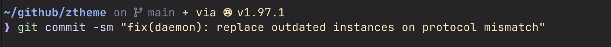
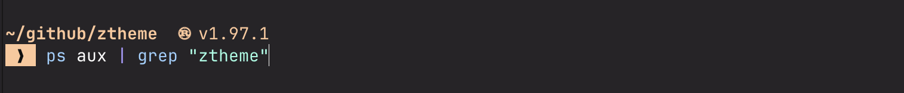
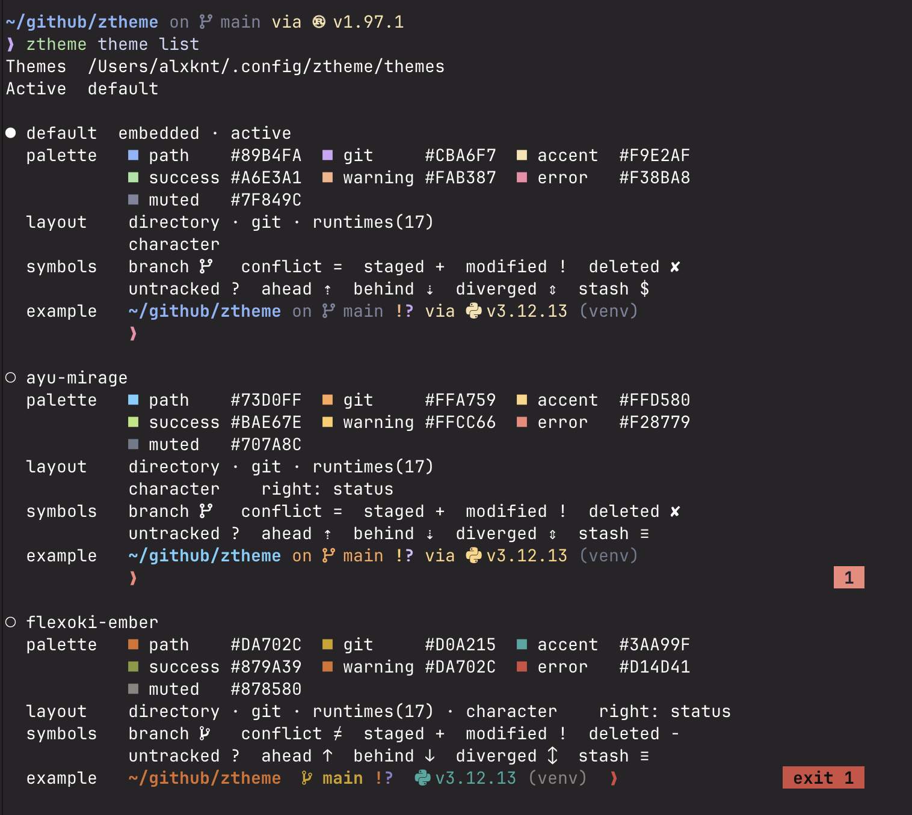

# ztheme

`ztheme` is a fast asynchronous Zsh prompt. It renders the directory, command
status, and prompt character immediately, then streams Git and runtime context
into the active prompt.

It has one user-local daemon, no Git writes or implicit fetches, and a typed
theme format without plugins or an interpreted template language.

<p align="center">
  
  <br>
  <sub>Default theme with asynchronous Git and runtime context.</sub>
</p>

<p align="center">
  
  <br>
  <sub>Vesper theme with a two-line prompt and themed command input.</sub>
</p>

Build and install:

```console
cargo install --locked --path ~/github/ztheme --root ~/.local --force
ztheme setup
```

Add the embedded integration to `.zshrc`:

```console
eval "$(ztheme init zsh)"
```

## Themes

Theme selection is separate from presentation:

```toml
# ${XDG_CONFIG_HOME:-$HOME/.config}/ztheme/config.toml
version = 1
theme = "alx"
```

A named theme is loaded from
`${XDG_CONFIG_HOME:-$HOME/.config}/ztheme/themes/alx.toml`. Absolute theme paths
are also accepted. Use `default` or omit the config file to select the embedded
default theme. A one-shell override is available during initialization:

```console
eval "$(ztheme init zsh --theme /absolute/path/to/theme.toml)"
```

Manage themes from an initialized shell:

```console
ztheme theme list
ztheme theme edit vesper
ztheme theme apply vesper
ztheme theme reload
```

<p align="center">
  
</p>

`theme list` always shows the embedded default first, followed by custom themes
from `${XDG_CONFIG_HOME:-$HOME/.config}/ztheme/themes`. It renders each theme's
semantic palette, layout, Git symbols, and a representative prompt example.
ANSI colors are emitted only to a terminal and are disabled when `NO_COLOR` is
set.

`theme edit` opens the selected external theme with nonempty `$VISUAL`, falling
back to nonempty `$EDITOR`, waits for the editor, and validates the result.
The embedded default is read-only. Editor values may contain arguments, such
as `VISUAL="code --wait"`.

`theme apply` validates and compiles the theme before atomically updating
`config.toml`, then evaluates the generated integration in the current shell.
`theme reload` rereads the exact selector active in the current shell without
changing `config.toml`; it is intended for the edit-and-reload loop. Both
commands leave the current prompt unchanged if theme compilation fails.

Custom themes overlay the embedded defaults, so they only need to contain the
values they change:

```toml
version = 1

[palette]
path = "#89b4fa"
muted = "#7f849c"
git = "#cba6f7"
accent = "#f9e2af"
success = "#a6e3a1"
warning = "#fab387"
error = "#f38ba8"

[layout]
lines = [
    ["directory", "git", "python"],
    ["character"],
]
right = ["status"]
separator = " "
blank_line_before = true

[segments.git]
prefix = "on "
symbol = " "

[segments.git.symbols]
modified = "!"
deleted = "✘"
untracked = "?"

[segments.python]
prefix = "via "
symbol = " "
version_prefix = "v"
style = { foreground = "accent" }
```

Available segments are `directory`, `git`, `character`, `status`, `python`,
`perl`, `java`, `kotlin`, `scala`, `rust`, `go`, `bun`, `deno`, `node`,
`ruby`, `php`, `dotnet`, `c`, `cpp`, `swift`, and `lua`.

Git and runtime segments are asynchronous and therefore left-prompt only.
`directory` and `status` may be placed in the final-line right prompt.
`character`, when present, must be the final segment of the final left line.
Segments cannot be repeated. The separator is inserted only between nonempty
segments.

Colors are either palette names or direct `#RRGGBB` values. Styles support
foreground and background colors, bold, underline, and standout. Theme
literals are escaped rather than interpreted as Zsh prompt code.

Input styling is inherited from the embedded default theme and is entirely
optional in custom themes. Override only the entries that should differ:

```toml
[input]
autosuggestion = { foreground = "muted" }
completion = { foreground = "accent" }

[input.syntax]
command = { foreground = "success", bold = true }
default = { foreground = "text" }
single-hyphen-option = { foreground = "text" }
double-hyphen-option = { foreground = "text" }
comment = { foreground = "muted" }
```

The keys under `input.syntax` map directly to documented
`ZSH_HIGHLIGHT_STYLES` names. Styles use the same typed fields as prompt
segments; `"none"` explicitly disables a syntax style. The embedded
`themes/default.toml` contains the complete mapping, including optional
bracket, cursor, line, and root highlighters. Pattern and regular-expression
highlighters use separate Zsh pattern maps and are not theme syntax styles.

The input styles are applied through
[zsh-syntax-highlighting](https://github.com/zsh-users/zsh-syntax-highlighting).
`ztheme setup` offers to install a pinned, checksum-verified copy under
`${XDG_DATA_HOME:-$HOME/.local/share}/ztheme/zsh-syntax-highlighting`.
The shell integration loads it once, after `.zshrc` has finished and before the
first interactive line. If another copy is already loaded, ztheme leaves it
alone. Missing or declined syntax highlighting never prevents the prompt from
starting and adds no recurring prompt work.

Every segment supports bounded unstyled outer spacing:

```toml
[segments.character]
prefix = " "
suffix = " "
spacing = { before = 0, after = 1 }
```

`prefix` and `suffix` remain inside the segment style, which makes them useful
as colored padding. `spacing.before` and `spacing.after` add zero to sixteen
ordinary spaces outside the style reset. They default to zero.

TOML is read, merged, and validated only by `ztheme init zsh`. Rust then
compiles an exact unrolled left/right compositor and a compact asynchronous
theme value. Prompt refreshes do not read or parse theme files. Re-run the
initialization, source `.zshrc`, or start a new shell after changing a theme.

Git status is provided exclusively by
[gitstatusd](https://github.com/romkatv/gitstatus). On first initialization,
`ztheme` checks its fixed managed path and, when missing, offers to install the
pinned upstream binary. Installation downloads the official artifact, verifies
its SHA-256 checksum, and stores it under
`${XDG_DATA_HOME:-$HOME/.local/share}/ztheme/gitstatus/v1.5`. For unattended
setup of both gitstatusd and syntax highlighting, run:

```console
ztheme setup --yes
```

The normal initialization path performs no platform detection, version process,
checksum, Homebrew lookup, or network work once that executable exists.

The public CLI exposes initialization, dependency setup, help, and
`ztheme clear`. The shell integration uses hidden commands for asynchronous
context updates and daemon startup.

A production shell always uses `/tmp/ztheme-$UID/daemon.sock`, regardless of
which binary path initialized it. A process-lifetime advisory lock guarantees
that only one production daemon can own that socket; the operating system
releases the lock immediately if the daemon exits or crashes. The next daemon
then replaces any stale socket before binding.

Shell initialization starts a daemon contender directly in the background.
There is no startup ping or version handshake: an existing daemon keeps the
singleton lock and the contender exits. Every normal cache or Git request
already carries the wire version in its fixed five-byte header. When a newer
client reaches an older daemon, that request makes the daemon shut down
cleanly; the client starts its replacement and retries the request. Older clients
cannot terminate newer daemons.

Additional instances require an explicit development name:

```console
eval "$(target/release/ztheme init zsh --dev feature)"
target/release/ztheme clear --dev feature
```

Each development name has its own singleton socket. Without `--dev NAME`, even
a development build joins the production instance.

The daemon keeps up to 500 semantic runtime snapshots in memory and persists them under
`${XDG_CACHE_HOME:-$HOME/.cache}/ztheme`. It binds the socket before loading
that file in the background, writes changes atomically after a short debounce,
and expires entries after 24 hours unless their project, environment, selector,
or executable fingerprint changes sooner. Access updates LRU order
without extending that safety expiry.

The same daemon owns one persistent gitstatusd child. Prompt clients never spawn
`git` and ztheme does not keep a second Git cache. `ztheme clear` discards the
runtime cache and restarts gitstatusd, while preserving the installed
executable.

The asynchronous snapshot process receives the precompiled theme value, formats
finished Git/runtime fragments in Rust, and streams only those fragments to
Zsh. The daemon remains theme-independent, and dynamic values are sanitized and
escaped for safe use with Zsh `PROMPT_SUBST`.

Upstream protocol boundaries are explicit:

- bare repositories are not reported by gitstatusd
- `GIT_DIR` is supported, but combining it with `GIT_WORK_TREE` is rejected
- gitstatusd reports renames as deleted plus new, so ztheme does not render a
  separate rename marker

gitstatusd is distributed under GPL-3.0. ztheme communicates with it as a
separate process through its documented pipe protocol.
